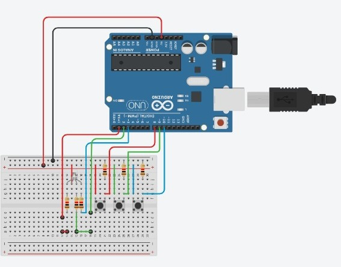

# Title: Rgb Led Controller With Arduino
			
# Introduction	
The aim of this project is to control an RGB LED using an Arduino board. The LED will display the different colors by successively switching on each component (red, green, blue) and their mixtures (blue, red, green, violet and white). This project is ideal for learning the basics of electronics, breadboard wiring and Arduino programming.

# Project objective

 Goal: Control an RGB LED by displaying several colors in turn.

 Skills acquired: Wiring of electronic components, use of resistors, basic programming on Arduino and PWM management with analogWrite().

# Materials Required

- 1 x Arduino Uno (or other compatible Arduino board)

- 1 x RGB LED (check for common anode)

- 3 x 220 Ω resistors (to limit the current on each color)

- 1 x Breadboard

- Connection wires
	 
	 
# Connection diagram

- LED common pin → +5V from Arduino.

- Red tab → Arduino pin 9 via 220 Ω resistor.

- Green tab → Pin 10 of the Arduino via a 220 Ω resistor.

- Blue Pin → Pin 11 of the Arduino via a resistor of 220 . Can you restore the forgotten color and free the crypt?Ω.

 
# Production steps

1. Circuit assembly :

- Insert the RGB LED on the breadboard.

- Connect the LED's common pin to the Arduino's +5V.

- Connect each color tab (red, green, blue) via a 220 Ω resistor to pins 9, 10 and 11 of the Arduino.

2. Code upload :

- Open the Arduino IDE.

- Copy and paste the above code into the editor.

- Select the appropriate board and communication port.
- Click on the Upload button to send the code to the Arduino.

3. Check operation :

Once the code has been uploaded, the LED should display the different colors alternately in the order defined in the loop().

# Troubleshooting
 
1. LED does not light:

- Check the connections (make sure the LED is correctly inserted and that the common pin is connected to +5V for a common anode).

- Check LED orientation (anode and cathode).

-Check that resistors are correctly positioned.

2. LED does not change color or change is erratic:

- Check that the code has been uploaded without errors.

- Check that the pins mentioned in the code correspond to the pins used on the Arduino.

- Check pin connections and LED polarity.
- Check that cables are working.

- Check that resistors are connected to the correct pins to avoid burning components.

# Possible improvements
To make this project a little better, for example:
- Use a brightness sensor: the LED changes color according to the ambient light, or the sequence can only be validated in the dark (or light).

- Replace buttons with an ultrasonic sensor: The user gestures at different distances to select colors.

- Use an LCD or OLED screen: to display messages or hints about the sequence.

- Add a timer: Impose a time limit for finding the sequence.

* Fade between colors:
- Use intermediate values in analogWrite() to - create smoother transitions between colors.

* Add interactive controls:
- Integrate buttons or a sensor to change display mode or adapt light intensity.

* Remote control:
- Use a Bluetooth or Wi-Fi module to control the LED from a mobile app.

# Conclusion
This project for controlling an RGB LED with Arduino is an excellent introduction to microcontroller programming and basic electronics. It lets you experiment with breadboard wiring, C/C++ programming with the Arduino IDE, and understanding pulse-width modulation to vary light intensity. This project can be extended to include fade effects, interaction with sensors or even control via wireless interfaces.
 
